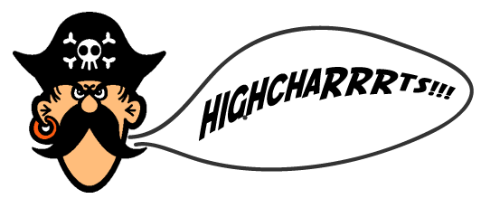

<center></center>
##generate interactive plots in AAAARRRRRRRR#
============
_[by csv soundsystem](http://www.csvsoundsystem.com/)_

An R package to create interactive HighCharts in JavaScript from a dataframe. You'll want to use dcast in the reshape2 package to format it nicely. [More on that](http://www.cookbook-r.com/Manipulating_data/Converting_data_between_wide_and_long_format/)

<p>Currently supported chart types: bar, line, area, column.<p>
<p>Chart types to come: scatterplot and others</p>
## Install the package

```
library("devtools")
install_github("highChaRRRts", "csvsoundsystem")
library("highChaRRRts")
```

## Basic usage

```
highChaRRRts(dcasted_df)
```

<p>Then in your console, cd to the directory it just created, default name "chart_output". Then create a simple web server such as</p>
```
python -m SimpleHTTPServer
```
<p>Then point your browser to 0.0.0.0:8000</p>

## All options

```
highChaRRRts(dcasted_df, type, main, xlab, ylab, output, pal)
```

## So...

```
highChaRRRts(dcasted_df, type="line", main="Title of the Chart", xlab="X Label", ylab="Y Label, output="chart_output", pal="RdYlBu")
```

## And an example...

```
library("devtools")
install_github("highChaRRRts", "csvsoundsystem")
library("highChaRRRts")

# generate example data...
group <- paste0("group_", 1:11)
var1 <- rnorm(11, mean=100, sd=30)
var2 <- rnorm(11, mean=100, sd=30)
var3 <- rnorm(11, mean=100, sd=30)
var4 <- rnorm(11, mean=100, sd=30)
var5 <- rnorm(11, mean=100, sd=30)
df <- data.frame(group, var1, var2, var3, var4, var5)

highChaRRRts(df,
             type="column",
             main="Title of the chart",
             xlab="X Label",
             ylab="Y Label",
             output = "chart_output",
             pal="Spectral")
```
Check out the charts [here](http://bitly.com/highChaRRRts)

## Questions?
Ask the developers / maintainers:
- [@brianabelson](http://www.twitter.com/brianabelson)
- [@mhkeller](http://www.twitter.com/mhkeller)
